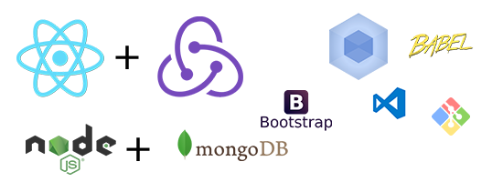

# Universal React App 

#### Live Here: _[https://reactuniversal.herokuapp.com](https://reactuniversal.herokuapp.com)_

 

 

* Uses **React** both in Client-Side and Server-Side
* Uses **Redux** to manage states
* Uses **Server-side React** rendering which makes the app an Isomorphic JavaScript App
* Uses **Node + Express** as backend
* Uses **MongoDB** for persisting data
* Latest version of **Webpack** for bundling and transpiling React and ES6

## How to use this app?

* Clone this repo
* Run _**npm install**_ - to install all the dependencies
* Run _**npm run mongod**_ - to start **MongoDB Server** in Windows
* Run _**npm start**_ - to start **NodeJS Server**
* Go to [http://localhost:3000](http://localhost:3000) - To  see the app running

There is one more NPM command _**npm run webpack**_ to run webpack while you're makingchanges in the client app.

#### Note: Please change the location of your MongoDB path for windows at line #7 in [package.json](./package.json)

##  Branches 

There are currently 2 more branches in this repo apart from the _**master**_ branch
 
* **client-app** : Contains the react-redux app before converting it into an Isomophic app
* **universal-app** : Contains the universal react app with server side rendering
* **production** : Contains the production build configs for webpack and removal of console logs

### TODO:

* Try to reduce the bundle size
* Will be working on the production version of this app
* Convert it into a PWA

### Contributors are welcome 

Since I am very new to React and Universal React apps I would like to learn more therefore opening issues and contributions are welcome. Just drop me a mails here: _[ashokdey100@gmail.com](#)_